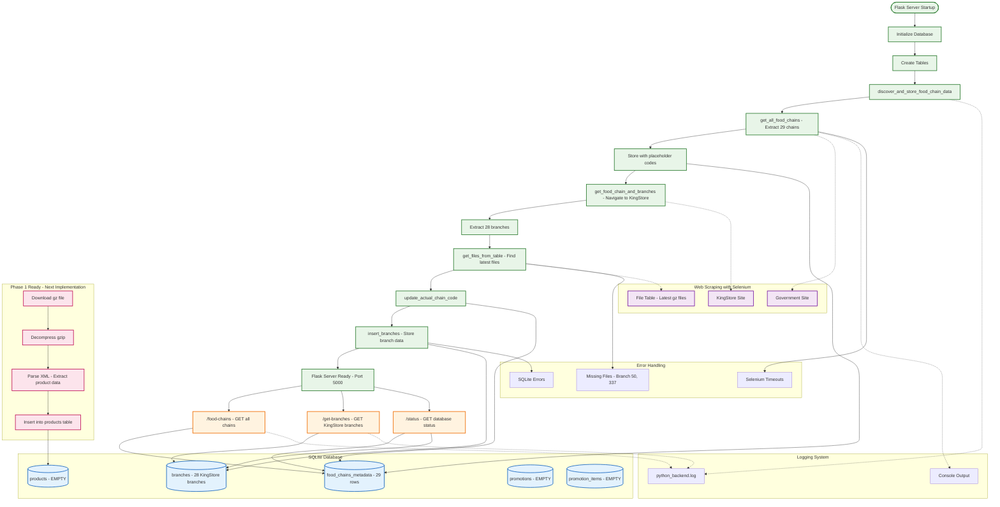

# Smart Shared List - System Flow Diagram

This diagram shows the current technical architecture and data flow of our food price comparison system.

```mermaid
flowchart TD
    %% SYSTEM STARTUP
    Start([Flask Server Startup]) --> InitDB[Initialize Database]
    InitDB --> CreateTables[Create Tables]
    CreateTables --> DiscoverChains[discover_and_store_food_chain_data]
    
    %% FOOD CHAIN DISCOVERY
    DiscoverChains --> GetAllChains[get_all_food_chains - Extract 29 chains]
    GetAllChains --> StoreChains[Store with placeholder codes]
    
    %% KINGSTORE DETAILED PROCESSING
    StoreChains --> GetKingStore[get_food_chain_and_branches - Navigate to KingStore]
    GetKingStore --> ExtractBranches[Extract 28 branches]
    ExtractBranches --> GetFiles[get_files_from_table - Find latest files]
    GetFiles --> UpdateActual[update_actual_chain_code]
    UpdateActual --> StoreBranches[insert_branches - Store branch data]
    
    %% API ENDPOINTS
    StoreBranches --> ServerReady[Flask Server Ready - Port 5000]
    ServerReady --> API1["/food-chains - GET all chains"]
    ServerReady --> API2["/get-branches - GET KingStore branches"]
    ServerReady --> API3["/status - GET database status"]
    
    %% DATABASE INTERACTIONS
    subgraph Database["SQLite Database"]
        FoodChains[("food_chains_metadata - 29 rows")]
        Branches[("branches - 28 KingStore branches")]
        Products[("products - EMPTY")]
        Promotions[("promotions - EMPTY")]
        PromotionItems[("promotion_items - EMPTY")]
    end
    
    %% WEB SCRAPING FLOW
    subgraph WebScraping["Web Scraping with Selenium"]
        GovSite["Government Site"]
        KingSite["KingStore Site"]
        FileTable["File Table - Latest gz files"]
    end
    
    %% PHASE 1 PREPARATION
    subgraph Phase1Prep["Phase 1 Ready - Next Implementation"]
        DownloadFile["Download gz file"]
        DecompressFile["Decompress gzip"]
        ParseXML["Parse XML - Extract product data"]
        InsertProducts["Insert into products table"]
    end
    
    %% CONNECTIONS
    GetAllChains -.-> GovSite
    GetKingStore -.-> KingSite
    GetFiles -.-> FileTable
    
    StoreChains --> FoodChains
    StoreBranches --> Branches
    UpdateActual --> FoodChains
    
    API1 --> FoodChains
    API2 --> Branches
    API3 --> FoodChains
    API3 --> Branches
    
    %% LOGGING SYSTEM
    subgraph Logging["Logging System"]
        LogFile["python_backend.log"]
        Console["Console Output"]
    end
    
    DiscoverChains -.-> LogFile
    GetAllChains -.-> Console
    API1 -.-> LogFile
    API2 -.-> LogFile
    
    %% ERROR HANDLING
    subgraph ErrorHandling["Error Handling"]
        MissingFiles["Missing Files - Branch 50, 337"]
        SeleniumErrors["Selenium Timeouts"]
        DatabaseErrors["SQLite Errors"]
    end
    
    GetFiles --> MissingFiles
    GetAllChains --> SeleniumErrors
    StoreBranches --> DatabaseErrors
    
    %% NEXT IMPLEMENTATION
    DownloadFile --> DecompressFile
    DecompressFile --> ParseXML
    ParseXML --> InsertProducts
    InsertProducts --> Products
    
    %% STYLING
    classDef implemented fill:#e8f5e8,stroke:#2e7d32,stroke-width:2px
    classDef database fill:#e3f2fd,stroke:#1565c0,stroke-width:2px
    classDef api fill:#fff3e0,stroke:#ef6c00,stroke-width:2px
    classDef nextPhase fill:#fce4ec,stroke:#c2185b,stroke-width:2px
    classDef external fill:#f3e5f5,stroke:#7b1fa2,stroke-width:2px
    
    class Start,InitDB,CreateTables,DiscoverChains,GetAllChains,StoreChains,GetKingStore,ExtractBranches,GetFiles,UpdateActual,StoreBranches,ServerReady implemented
    class FoodChains,Branches,Products,Promotions,PromotionItems database
    class API1,API2,API3 api
    class DownloadFile,DecompressFile,ParseXML,InsertProducts nextPhase
    class GovSite,KingSite,FileTable external
``` 